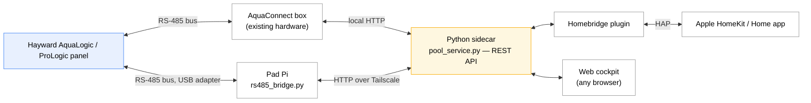

# homebridge-prologic

[](LICENSE)

A Homebridge platform plugin — plus a Python sidecar and a web cockpit — for
**Hayward ProLogic / AquaLogic / AquaPlus** pool controllers.

Most Hayward Homebridge plugins expose a handful of on/off switches. This one
drives the panel's actual settings menus, so you get real control from
HomeKit and a browser, not just toggles:

- **Heat** — set the target temperature per body, not just on/off
- **Lights** — pick a named color/scene (Hayward ColorLogic pool light,
  Pentair IntelliBrite spa light)
- **Chlorinator** — set the salt-cell output %, per body
- **Pump** — variable-speed presets (VSP slots)
- **Circuits** — filter, spa/pool mode, aux, spillover, super-chlorinate,
  heater enable

> **Status:** pre-1.0, not yet published to npm. See [Installation](#installation)
> for installing from source.

## How it fits together



Everything talks to the **Python sidecar** (`sidecar/pool_service.py`), a REST
API that owns the connection to your panel and is the single source of truth
for its state. The **Homebridge plugin** polls it and exposes your equipment
in HomeKit; the **web cockpit** (a self-contained page the sidecar serves) is
a second, independent way to control everything from a browser — useful for
anything HomeKit doesn't model well, like scene pickers and a temperature
history chart.

The sidecar reaches the panel through exactly one of two backends, chosen in
config:

- **AquaConnect** — HTTP to an existing AquaConnect (ACHN) box's local
  network interface. No extra hardware; works today if you already have one.
- **Direct RS-485** — a small **Pi Zero "pad bridge"** wired straight onto
  the panel's RS-485 bus (`sidecar/rs485_bridge.py`, reached over Tailscale).
  This is the fallback for installs without an AquaConnect box, and a hedge
  against AquaConnect access ever being restricted.

Both backends expose the same features through the same sidecar API — the
plugin and cockpit don't know or care which one is active.

## Hardware setup

### AquaConnect backend

No extra hardware — point the sidecar at your AquaConnect box's IP (see
[Installation](#installation)).

### RS-485 backend — the pad bridge

Runs on a small **Pi Zero** wired to the panel's RS-485 bus via a USB-RS485
adapter, as a systemd service (`pool-bridge`) reachable over Tailscale. Full
build and re-image runbook: [`deploy/README-PAD.md`](deploy/README-PAD.md);
provisioning script: [`deploy/install-pad.sh`](deploy/install-pad.sh).

RS-485 wiring to the AquaPlus PCB (adapter to **J2**/**J4** on the main
board): A+ → Pin 2 (DATA+), B− → Pin 3 (DATA−), GND → Pin 4 (GND).

> Earlier prototypes used a WiFi/ethernet serial bridge (transparent
> TCP↔serial) instead of a Pi. That **did not work** — the panel only accepts
> a keypress in a narrow window after each keep-alive, which a transparent
> bridge can't hit reliably, so reads worked but writes were silently
> dropped. The Pi pad bridge replaced it and is the only supported RS-485
> path.

## Installation

Not yet on npm — install from source for now.

### 1. Get the code

```bash
git clone https://github.com/homebridge-fun/homebridge-prologic.git
cd homebridge-prologic
npm install
npm run build
```

### 2. Install the Python sidecar (on the Homebridge host)

`sidecar/install.sh` creates a venv, installs Flask, and registers the
`pool-sidecar` systemd service pointed at your chosen backend:

```bash
# AquaConnect box (local HTTP) — use your box's IP:
sudo bash sidecar/install.sh --backend aquaconnect --aquaconnect-host 192.168.50.100

# OR the RS-485 pad bridge — set up the pad first (deploy/README-PAD.md), then
# point at its tailnet IP (token via --rs485bridge-token if the bridge requires one):
sudo bash sidecar/install.sh --backend rs485bridge --rs485bridge-host <pad-tailnet-ip>
```

Add `--dry-run` to preview the systemd unit without changing anything.
Verify it's running:

```bash
sudo systemctl status pool-sidecar
curl http://127.0.0.1:5757/status
```

### 3. Link the plugin into Homebridge

```bash
npm link           # inside the homebridge-prologic checkout
cd /path/to/homebridge && npm link homebridge-prologic
```

(Once published to npm, this step becomes `npm install -g homebridge-prologic`
or installing it through the Homebridge UI's plugin search.)

### 4. Configure

Add to your Homebridge `config.json` (or use the Homebridge UI's plugin
settings form, which reads `config.schema.json`):

```json
{
  "platform": "ProLogic",
  "name": "ProLogic",
  "backend": "aquaconnect",
  "aquaconnectHost": "192.168.50.100",
  "sidecarHost": "127.0.0.1",
  "sidecarPort": 5757,
  "pollInterval": 5000,
  "circuits": ["POOL", "SPA", "FILTER", "LIGHTS", "HEATER_1"],
  "enableActiveHeaterThermostat": true,
  "enableTemperatureSensors": true
}
```

Available `circuits`: `POOL`, `SPA`, `FILTER`, `LIGHTS`, `SPILLOVER`, `AUX_1`,
`AUX_2`, `HEATER_1`, `SUPER_CHLORINATE`. Rename any of them with
`circuitLabels`, e.g. `{"AUX_1": "Spa Light"}`.

Feature flags (all default off except where noted): `enableActiveHeaterThermostat`
(default **on**), `enableTemperatureSensors`, `enableChlorinatorFan`,
`enableSaltSensor`, `enableSpaLightScenes`, `enablePoolLightScenes` (with
`spaLightSceneList` / `poolLightSceneList` to choose and reorder which named
scenes appear). See `config.schema.json` for the full, current reference —
it's what drives the Homebridge UI's settings form, so it never drifts from
what the plugin actually reads.

## HomeKit accessories

| Accessory | Type | Enabled by |
|---|---|---|
| Pool / Spa | Switch | `circuits` includes `POOL`/`SPA` — shared toggle (on = that body active) |
| Filter | Switch | `circuits` includes `FILTER` |
| Lights | Switch | `circuits` includes `LIGHTS` (plain on/off; see **Pool/Spa Lights** below for scenes) |
| Aux 1 / Aux 2 | Switch | `circuits` includes `AUX_1`/`AUX_2` |
| Spillover | Switch | `circuits` includes `SPILLOVER` |
| Super Chlorinate | Switch | `circuits` includes `SUPER_CHLORINATE`. Shows its live countdown where supported |
| Heater Auto | Switch | `circuits` includes `HEATER_1` — arms/disarms the heater |
| Heater Running | Switch (read-only) | Registered alongside Heater Auto — lit only while the relay is actually firing |
| Active Heat | Thermostat | `enableActiveHeaterThermostat` (default on) — mirrors whichever body (pool/spa) is currently active; set the target temperature directly from the dial |
| Pool Lights / Spa Lights | Television | `enablePoolLightScenes` / `enableSpaLightScenes` — power + a named-scene picker, published as an external accessory |
| Pool Temperature / Air Temperature | Temperature Sensor | `enableTemperatureSensors` |
| Salt Level | Air Quality Sensor | `enableSaltSensor` — salt PPM carried in the VOC-density field |
| Chlorinator | Fan | `enableChlorinatorFan` — output % on the fan speed slider, mirrors whichever body is active |
| Bridge Offline / Bridge Needs Rebooting | Switch | Always registered — see [Bridge health & wedge recovery](#bridge-health--wedge-recovery) |

Pump/VSP speeds aren't exposed to HomeKit (no natural HomeKit control fits a
4-preset speed slot); use the web cockpit for those.

## The web cockpit

The sidecar serves a self-contained web page at `http://<sidecar-host>:5757/`
— no separate install. It's a second, independent front end to the same
sidecar API, useful for the things HomeKit doesn't model well:

- Named light-scene pickers for both bodies, with a live "current scene"
  readout
- A temperature history chart (with a real gap shown across a feed outage,
  not a misleading flat line)
- Manual panel navigation and a live LCD display mirror
- Everything stages behind a single **Apply** button — nothing fires until
  you confirm, since the panel can only process one command at a time

## Capabilities & limitations

The sidecar drives the panel's Settings-menu navigation, not just the
`aqualogic` library's raw toggle/read surface — so setpoints, chlorinator
output, and pump speeds are fully **adjustable**, not just readable.

**Still panel-only:** freeze protection, timers/schedules, relay/valve
configuration, and the clock — these aren't automated. Light scene selection
is **open-loop** (the panel doesn't report which program is showing, so the
displayed scene is the last one commanded, not a live read).

Menu-navigated writes (setpoints, chlorinator %, VSP, super-chlorinate) walk
the panel's single-lane menu, so they take a couple of seconds and are
serialized — the cockpit stages them behind Apply rather than firing each
step immediately.

## Bridge health & wedge recovery

The sidecar tracks command-path health as `bridge_wedged`, surfaced as the
Bridge switch above and a cockpit banner. **Recovery differs by backend —
this is a setup requirement, not just an internal detail:**

- **AquaConnect backend** — the box can enter a silent read-only mode that
  **only a physical power-cycle clears**. On a wedge the sidecar starts a
  120s cooldown and blocks commands, expecting the box to reboot in that
  window. **This presumes you've set up an automated power-cycle** — a
  HomeKit automation that cuts power to a smart plug feeding the box when
  "Bridge Needs Rebooting" turns on. Without that automation, recovery is
  manual (you power-cycle the box yourself); the switch won't clear on its
  own.

- **RS-485 backend** — no box to power-cycle. A "wedge" here just means the
  pad daemon was briefly unreachable (usually Wi-Fi). It shows a mild,
  **self-clearing "Bridge Offline"** state driven purely by reachability — no
  cooldown, no command blocking, no automation required. If it happens
  often, the fix is physical (improve the pad's Wi-Fi signal or wire it to
  the main LAN — see `deploy/README-PAD.md`), not a recovery automation.

## Acknowledgments

- **[cupshir/homebridge-aqua-connect-lite](https://github.com/cupshir/homebridge-aqua-connect-lite)**
  — the AquaConnect Homebridge plugin the author ran before building this
  one. Prior art and inspiration for the AquaConnect approach here; this
  project grew out of wanting deeper control and a fallback path.
- **[`swilson/aqualogic`](https://github.com/swilson/aqualogic)** — the
  Python RS-485 protocol library that decodes the AquaLogic bus. Runs on the
  pad bridge; it's what makes the direct-RS-485 backend possible.
- **[`SteveTheGeekHA/AquaConnectDeviceHandler`](https://github.com/SteveTheGeekHA/AquaConnectDeviceHandler)**
  — reference implementation used to verify the AquaConnect web key codes
  and protocol.

## License

[MIT](LICENSE)
