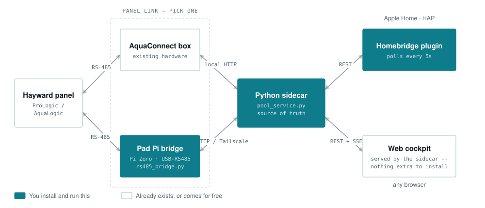

# homebridge-prologic

[](LICENSE)

A Homebridge platform plugin — plus a Python sidecar and a web cockpit — for
**Hayward ProLogic / AquaLogic / AquaPlus** pool controllers.

Most Hayward Homebridge plugins expose a handful of on/off switches. This one
drives the panel's actual settings menus, so you get real control from
HomeKit and a browser, not just toggles:

- **Heat** — set the target temperature per body, not just on/off
- **Lights** — pick a named color/scene (Hayward ColorLogic or Pentair
  IntelliBrite; which standard is on which relay is configurable)
- **Chlorinator** — set the salt-cell output %, per body
- **Pump** — variable-speed presets (VSP slots)
- **Circuits** — filter, spa/pool mode, aux, spillover, super-chlorinate,
  heater enable

> **Status:** pre-1.0, not yet published to npm. See [Installation](#installation)
> for installing from source.
>
> **All of the code in this project was written by
> [Claude Code](https://claude.com/claude-code)** in an agent-first development
> model, directed and hardware-verified by the maintainer. See
> [How this was built](#how-this-was-built).

## What you'll need

This is **not a single-package install.** The plugin depends on a Python
sidecar service running alongside Homebridge, and depending on your setup, a
second Raspberry Pi. Worth knowing before you invest any time:

| | Requirement |
|---|---|
| **Homebridge** | 2.0 or newer, running on **Node 22 or 24** |
| **Host** | A Linux host that can run a `systemd` service alongside Homebridge — normally the same Pi |
| **Link to the panel** | **One of:** an existing **AquaConnect (ACHN) box** on your LAN, **or** a spare **Pi Zero + USB-RS485 adapter** wired to the panel's bus |
| **Tailscale** | **Only for the RS-485 path** — a (free) Tailscale account, with `tailscaled` running on **both** the Homebridge host and the pad Pi. See below |
| **Comfort level** | Terminal access — cloning a repo, running an installer, editing config by hand. There is no install-from-the-Homebridge-UI path today |

The sidecar is what makes the deeper features possible. Setpoints, light
scenes, chlorinator %, and pump speeds all require *navigating the panel's
real settings menus*, which is a stateful, timing-sensitive job that can't be
done from inside a Homebridge plugin process. That's the reason for the extra
moving part.

> **If all you want is a few on/off switches**, this project is heavier than
> you need — the sidecar only earns its keep if you want the settings-level
> control listed above.

## How it fits together

<picture>
  <source media="(prefers-color-scheme: dark)" srcset="docs/architecture-dark.svg">
  
</picture>

**Filled boxes are the pieces you install and run.** Everything else either
already exists (your panel, an AquaConnect box) or comes along for free (the
cockpit is served by the sidecar).

Everything talks to the **Python sidecar** (`sidecar/pool_service.py`), a REST
API that owns the connection to your panel and is the single source of truth
for its state. The **Homebridge plugin** polls it and exposes your equipment
in HomeKit; the **web cockpit** (a self-contained page the sidecar serves) is
a second, independent way to control everything from a browser — useful for
anything HomeKit doesn't model well, like scene pickers and a temperature
history chart.

The sidecar reaches the panel through exactly one of two backends, chosen in
config:

- **AquaConnect** — HTTP to an existing AquaConnect (ACHN) box's local
  network interface. No extra hardware; works today if you already have one.
- **Direct RS-485** — a small **Pi Zero "pad bridge"** wired straight onto
  the panel's RS-485 bus (`sidecar/rs485_bridge.py`, reached over Tailscale).
  This is the fallback for installs without an AquaConnect box, and a hedge
  against AquaConnect access ever being restricted.

Both backends expose the same features through the same sidecar API — the
plugin and cockpit don't know or care which one is active.

## Hardware setup

### AquaConnect backend

No extra hardware — point the sidecar at your AquaConnect box's IP (see
[Installation](#installation)).

### RS-485 backend — the pad bridge

Runs on a small **Pi Zero** wired to the panel's RS-485 bus via a USB-RS485
adapter, as a systemd service (`pool-bridge`). Full build and re-image
runbook: [`deploy/README-PAD.md`](deploy/README-PAD.md); provisioning script:
[`deploy/install-pad.sh`](deploy/install-pad.sh).

RS-485 wiring to the AquaPlus PCB (adapter to **J2**/**J4** on the main
board): A+ → Pin 2 (DATA+), B− → Pin 3 (DATA−), GND → Pin 4 (GND).

#### Tailscale is part of this backend, not an optional extra

The sidecar reaches the pad daemon **over a Tailscale tailnet**, so both ends
need it:

- A **Tailscale account** (the free tier is sufficient).
- `tailscaled` installed and logged in on the **pad Pi** *and* on the
  **Homebridge host** — both must be on the same tailnet, or the sidecar
  simply cannot reach the bridge.
- `install-pad.sh` binds the daemon to the pad's **tailnet IP only**, so
  nothing on the local Wi-Fi can open the socket. That address is also stable
  across network changes, which is why moving the Pi between networks needs
  no reconfiguration.

Two things that trip people up:

- **Put the pad on your main LAN, not a guest network.** Guest-network client
  isolation stops the two machines hole-punching, so Tailscale falls back to
  relaying every packet through a public DERP server — which still works and
  is still encrypted, but adds latency and intermittent timeouts. Verify with
  `tailscale ping pool` from the Homebridge host: it should say `direct`, not
  `via DERP`.
- **To use the MagicDNS name** (`pool`) rather than a raw tailnet IP, the
  Homebridge host has to accept tailnet DNS: `tailscale set --accept-dns=true`,
  then check `getent hosts pool` resolves.

If you skip Tailscale entirely, `install-pad.sh` falls back to binding
`0.0.0.0` and you would be exposing the bridge to your whole LAN with no
authentication unless you set a bearer token. That path isn't tested or
supported — the security model documented in
[`deploy/README-PAD.md`](deploy/README-PAD.md) assumes the tailnet.

> Earlier prototypes used a WiFi/ethernet serial bridge (transparent
> TCP↔serial) instead of a Pi. That **did not work** — the panel only accepts
> a keypress in a narrow window after each keep-alive, which a transparent
> bridge can't hit reliably, so reads worked but writes were silently
> dropped. The Pi pad bridge replaced it and is the only supported RS-485
> path.

## Installation

Not yet on npm — install from source for now.

> **Addresses below are placeholders — substitute your own.**
>
> | Placeholder | What it stands for |
> |---|---|
> | `<aquaconnect-ip>` | Your AquaConnect box on the LAN — a private `192.168.x.y` address. Find it in your router's client list |
> | `<pad-tailnet-ip>` | The pad Pi's Tailscale address (`tailscale ip -4` on the pad), or its MagicDNS name, e.g. `pool` |
> | `127.0.0.1` | Not a placeholder — the sidecar binds localhost deliberately and is reached there from the Homebridge host |

### 1. Get the code

```bash
git clone https://github.com/homebridge-fun/homebridge-prologic.git
cd homebridge-prologic
npm install
npm run build
```

### 2. Install the Python sidecar (on the Homebridge host)

`sidecar/install.sh` creates a venv, installs Flask, and registers the
`pool-sidecar` systemd service pointed at your chosen backend:

```bash
# AquaConnect box (local HTTP) — use your box's IP:
sudo bash sidecar/install.sh --backend aquaconnect --aquaconnect-host <aquaconnect-ip>

# OR the RS-485 pad bridge — set up the pad first (deploy/README-PAD.md), then
# point at its tailnet IP (token via --rs485bridge-token if the bridge requires one):
sudo bash sidecar/install.sh --backend rs485bridge --rs485bridge-host <pad-tailnet-ip>
```

Add `--dry-run` to preview the systemd unit without changing anything.
Verify it's running:

```bash
sudo systemctl status pool-sidecar
curl http://127.0.0.1:5757/status
```

### 3. Link the plugin into Homebridge

```bash
npm link           # inside the homebridge-prologic checkout
cd /path/to/homebridge && npm link homebridge-prologic
```

(Once published to npm, this step becomes `npm install -g homebridge-prologic`
or installing it through the Homebridge UI's plugin search.)

### 4. Configure

Add to your Homebridge `config.json` (or use the Homebridge UI's plugin
settings form, which reads `config.schema.json`):

```json
{
  "platform": "ProLogic",
  "name": "ProLogic",
  "backend": "aquaconnect",
  "aquaconnectHost": "<aquaconnect-ip>",
  "sidecarHost": "127.0.0.1",
  "sidecarPort": 5757,
  "pollInterval": 5000,
  "circuits": ["POOL", "SPA", "FILTER", "LIGHTS", "HEATER_1"],
  "enableActiveHeaterThermostat": true,
  "enableTemperatureSensors": true
}
```

Available `circuits`: `POOL`, `SPA`, `FILTER`, `LIGHTS`, `SPILLOVER`, `AUX_1`,
`AUX_2`, `HEATER_1`, `SUPER_CHLORINATE`. Rename any of them with
`circuitLabels`, e.g. `{"AUX_1": "Spa Light"}`.

Feature flags (all default off except where noted): `enableActiveHeaterThermostat`
(default **on**), `enableTemperatureSensors`, `enableChlorinatorFan`,
`enableSaltSensor`, `enableSpaLightScenes`, `enablePoolLightScenes` (with
`spaLightSceneList` / `poolLightSceneList` to choose and reorder which named
scenes appear). See `config.schema.json` for the full, current reference —
it's what drives the Homebridge UI's settings form, so it never drifts from
what the plugin actually reads.

## HomeKit accessories

| Accessory | Type | Enabled by |
|---|---|---|
| Pool / Spa | Switch | `circuits` includes `POOL`/`SPA` — shared toggle (on = that body active) |
| Filter | Switch | `circuits` includes `FILTER` |
| Lights | Switch | `circuits` includes `LIGHTS` (plain on/off; see **Pool/Spa Lights** below for scenes) |
| Aux 1 / Aux 2 | Switch | `circuits` includes `AUX_1`/`AUX_2` |
| Spillover | Switch | `circuits` includes `SPILLOVER` |
| Super Chlorinate | Switch | `circuits` includes `SUPER_CHLORINATE`. Shows its live countdown where supported |
| Heater Auto | Switch | `circuits` includes `HEATER_1` — arms/disarms the heater |
| Heater Running | Switch (read-only) | Registered alongside Heater Auto — lit only while the relay is actually firing |
| Active Heat | Thermostat | `enableActiveHeaterThermostat` (default on) — mirrors whichever body (pool/spa) is currently active; set the target temperature directly from the dial |
| Pool Lights / Spa Lights | Television | `enablePoolLightScenes` / `enableSpaLightScenes` — power + a named-scene picker, published as an external accessory |
| Pool Temperature / Air Temperature | Temperature Sensor | `enableTemperatureSensors` |
| Salt Level | Air Quality Sensor | `enableSaltSensor` — salt PPM carried in the VOC-density field |
| Chlorinator | Fan | `enableChlorinatorFan` — output % on the fan speed slider, mirrors whichever body is active |
| Bridge Offline / Bridge Needs Rebooting | Switch | Always registered — see [Bridge health & wedge recovery](#bridge-health--wedge-recovery) |

Pump/VSP speeds aren't exposed to HomeKit (no natural HomeKit control fits a
4-preset speed slot); use the web cockpit for those.

## The web cockpit

The sidecar serves a self-contained web page at `http://<sidecar-host>:5757/`
— no separate install. It's a second, independent front end to the same
sidecar API, useful for the things HomeKit doesn't model well:

- Named light-scene pickers for both bodies, with a live "current scene"
  readout
- A temperature history chart (with a real gap shown across a feed outage,
  not a misleading flat line)
- Manual panel navigation and a live LCD display mirror
- Everything stages behind a single **Apply** button — nothing fires until
  you confirm, since the panel can only process one command at a time

## Lights

Scene selection works by **power-cycling the light's relay** — the only
mechanism a ProLogic/AquaLogic panel offers. Two standards are supported, and
they count differently, so telling the plugin which one you have matters:

| Standard | How a scene is selected |
|---|---|
| **Hayward ColorLogic / UCL** | *Relative* — each off/on pulse advances one program from wherever the light currently is, with no absolute addressing, so the plugin tracks position |
| **Pentair IntelliBrite 5G** | *Absolute* — from a full reset, N pulses selects program N directly |

Set which standard is on which relay in the plugin settings:
`poolLightType` / `poolLightCircuit` and `spaLightType` / `spaLightCircuit`.
Defaults describe the reference installation (pool = ColorLogic on `LIGHTS`,
spa = IntelliBrite on `AUX_1`), but nothing requires one of each — two lights
of the same standard is a perfectly normal setup.

> **Not supported: Hayward OmniDirect.** Newer networked ColorLogic lighting
> paired with **OmniLogic** automation offers instant colour selection,
> dimming and show-speed control *without* power cycling. That is a different
> automation platform with a different wire protocol — it is out of scope
> here, not a gap that configuration can close. This plugin targets
> ProLogic/AquaLogic panels, where power cycling is how these lights are
> driven.

Because selection is open-loop — the panel cannot report which colour a light
is currently showing — the plugin tracks the position it believes the light is
in. The cockpit has a **Resync colors** button for when that drifts.

## Capabilities & limitations

The sidecar drives the panel's Settings-menu navigation, not just the
`aqualogic` library's raw toggle/read surface — so setpoints, chlorinator
output, and pump speeds are fully **adjustable**, not just readable.

**Not currently exposed — by choice, not by limitation:** timers and
schedules, relay/valve configuration, freeze protection, and the clock. The
sidecar drives the *same* menu system a person uses at the keypad, so these
screens are reachable and readable like any other; a menu walk shows filter
timers, cell diagnostics and firmware revisions perfectly legibly. What's
exposed in HomeKit and the cockpit is a deliberate selection — surfacing
every menu item would mean a great many tiles for things you set once a
season, and the write paths for scheduling deserve more care than a
read-only reading does. If something here would earn its place, it's a
scope decision to revisit, not a wall.

**Genuinely limited:** light scene selection is **open-loop** — the panel
doesn't report which program is showing, so the displayed scene is the last
one commanded rather than a live read.

Menu-navigated writes (setpoints, chlorinator %, VSP, super-chlorinate) walk
the panel's single-lane menu, so they take a couple of seconds and are
serialized — the cockpit stages them behind Apply rather than firing each
step immediately.

## Bridge health & wedge recovery

The sidecar tracks command-path health as `bridge_wedged`, surfaced as the
Bridge switch above and a cockpit banner. **Recovery differs by backend —
this is a setup requirement, not just an internal detail:**

- **AquaConnect backend** — the box can enter a silent read-only mode that
  **only a physical power-cycle clears**. On a wedge the sidecar starts a
  120s cooldown and blocks commands, expecting the box to reboot in that
  window. **This presumes you've set up an automated power-cycle** — a
  HomeKit automation that cuts power to a smart plug feeding the box when
  "Bridge Needs Rebooting" turns on. Without that automation, recovery is
  manual (you power-cycle the box yourself); the switch won't clear on its
  own.

- **RS-485 backend** — no box to power-cycle. A "wedge" here just means the
  pad daemon was briefly unreachable (usually Wi-Fi). It shows a mild,
  **self-clearing "Bridge Offline"** state driven purely by reachability — no
  cooldown, no command blocking, no automation required. If it happens
  often, the fix is physical (improve the pad's Wi-Fi signal or wire it to
  the main LAN — see `deploy/README-PAD.md`), not a recovery automation.

## For contributors

The docs above cover installing and using the plugin. For the deeper
engineering detail — sidecar internals, the RS-485/AquaConnect wire protocol,
menu-navigation state machines, and the full HomeKit/cockpit surface — see:

- **[`docs/plugin-spec.md`](docs/plugin-spec.md)** — plugin, sidecar, and
  cockpit architecture and behavior.
- **[`docs/aqualogic-automation-spec.md`](docs/aqualogic-automation-spec.md)**
  — panel protocol and menu-navigation detail underneath the sidecar.
- **[`docs/backlog.md`](docs/backlog.md)** — the prioritized list of open
  work, including what is deliberately *not* being done.
- **[`docs/testing-strategy.md`](docs/testing-strategy.md)** — what a real
  test suite would cover here, and in what order.

There's no separate `CONTRIBUTING.md` yet; open an issue or PR and start a
conversation.

## How this was built

**Every line of code in this repository was written by
[Claude Code](https://claude.com/claude-code)**, in an agent-first development
model. The maintainer set direction, made the design and judgement calls, and
verified all of it against real hardware; the agent did the implementation,
the protocol reverse-engineering, and the documentation — including this
sentence.

This is stated plainly because you should know it before you run software that
controls pool equipment, and before you contribute to it.

That shows up in the repo in a few ways worth knowing about:

- **The specs in [`docs/`](docs/) are unusually detailed** because they serve as
  the agent's working reference as much as a human's. They record *why* things
  are the way they are — which timings wedge the panel, which frame formats
  actually appear on the bus, which approaches were tried and abandoned.
- **The protocol work was empirical**, not derived from vendor documentation.
  Behaviors were found by observing a live panel, and the specs tag findings by
  provenance (verified on hardware, from the manual, or inferred).
- **It has been validated on one physical installation** — a ProLogic PS-series
  panel with pool + spa, no spillover or solar. Other configurations should
  work, but haven't been proven. Bug reports that include a
  `/display/history` dump are especially useful, since they capture real panel
  output from hardware the maintainer doesn't have.

## Acknowledgments

- **[cupshir/homebridge-aqua-connect-lite](https://github.com/cupshir/homebridge-aqua-connect-lite)**
  — the AquaConnect Homebridge plugin the author ran before building this
  one. Prior art and inspiration for the AquaConnect approach here; this
  project grew out of wanting deeper control and a fallback path.
- **[`swilson/aqualogic`](https://github.com/swilson/aqualogic)** — the
  Python RS-485 protocol library that decodes the AquaLogic bus. Runs on the
  pad bridge; it's what makes the direct-RS-485 backend possible.
- **[`SteveTheGeekHA/AquaConnectDeviceHandler`](https://github.com/SteveTheGeekHA/AquaConnectDeviceHandler)**
  — reference implementation used to verify the AquaConnect web key codes
  and protocol.

## License

[MIT](LICENSE)
